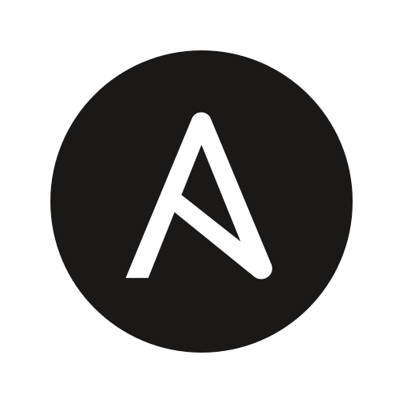
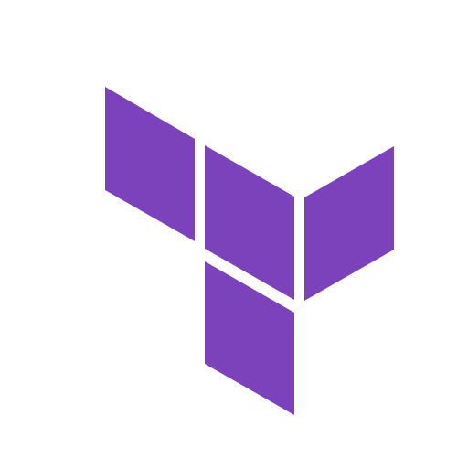
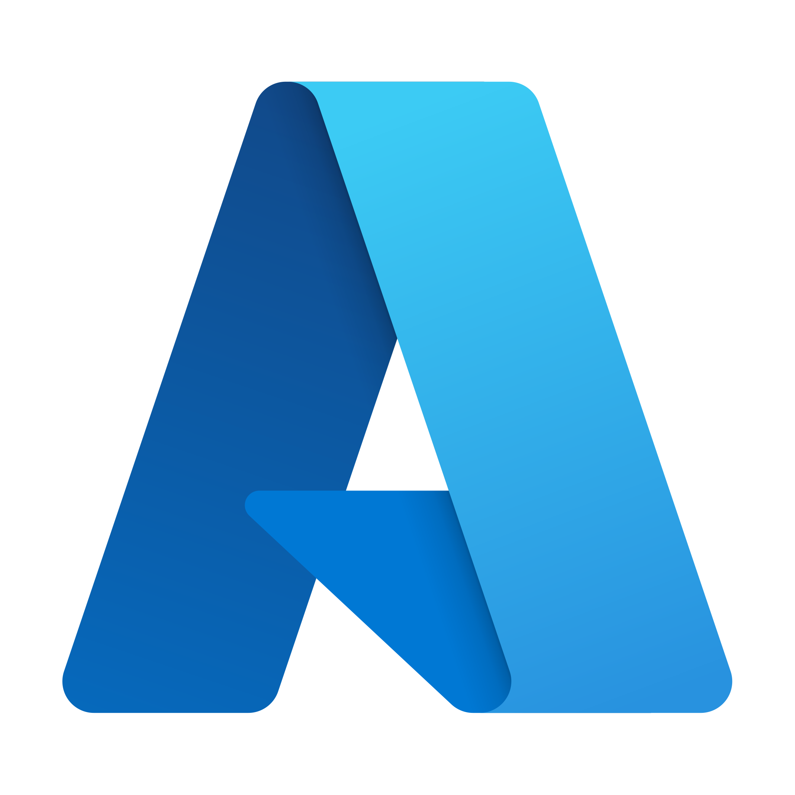
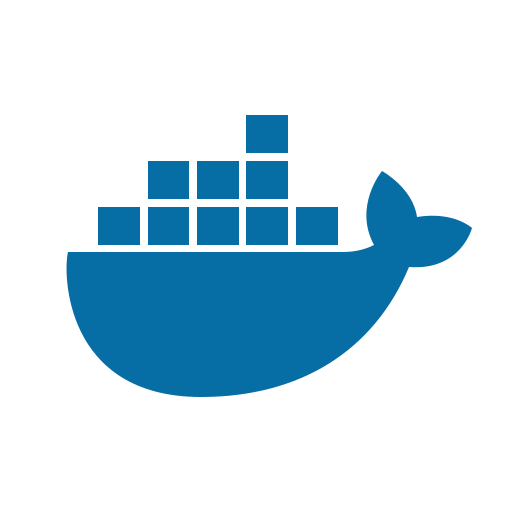
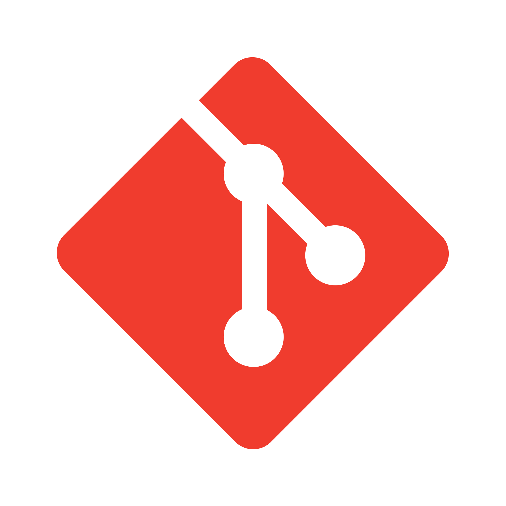
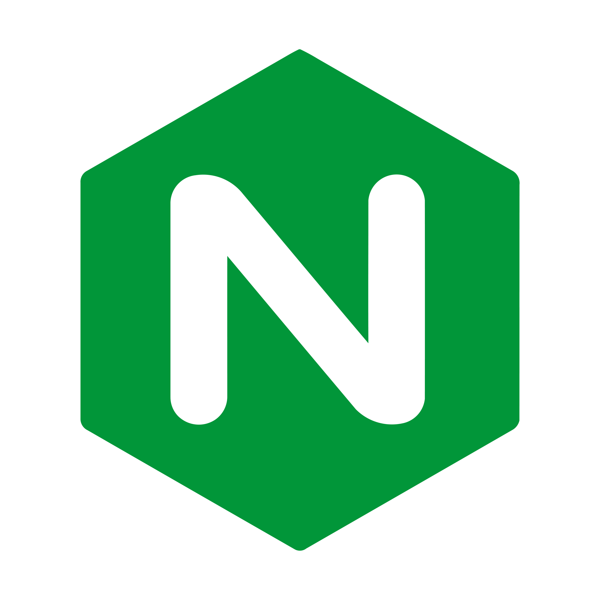

<h1 align="center"> Hi, I'm Mehdi!</h1>
<h3 align="center">A passionate DevOps Engineer from france Living in Canada</h3>

- 🏢 I'm currently working as a **DevOps Engineer** in **Montreal**!
- 🌱 I'm currently preparing the **AWS Solutions Architech Associate certification (AWS-SAA)** !
- ♥️ I love working on **automation** and **high availability** projects!
- 💬 You can ask me questions about **Ansible**, **Terraform** and **Linux**
- ✍️ I read articles on my DevOps Journey here : https://mehdibennouar.hashnode.dev/
  

## Languages and Tools:
  
 
    
    
    
     
     
    
     </a> 
    
    
    

&nbsp;

<!--
**MehdiBenIT/MehdiBenIT** is a ✨ _special_ ✨ repository because its `README.md` (this file) appears on your GitHub profile.

Here are some ideas to get you started:

- 🔭 I’m currently working on ...
- 🌱 I’m currently learning ...
- 👯 I’m looking to collaborate on ...
- 🤔 I’m looking for help with ...
- 💬 Ask me about ...
- 📫 How to reach me: ...
- 😄 Pronouns: ...
- ⚡ Fun fact: ...
-->
